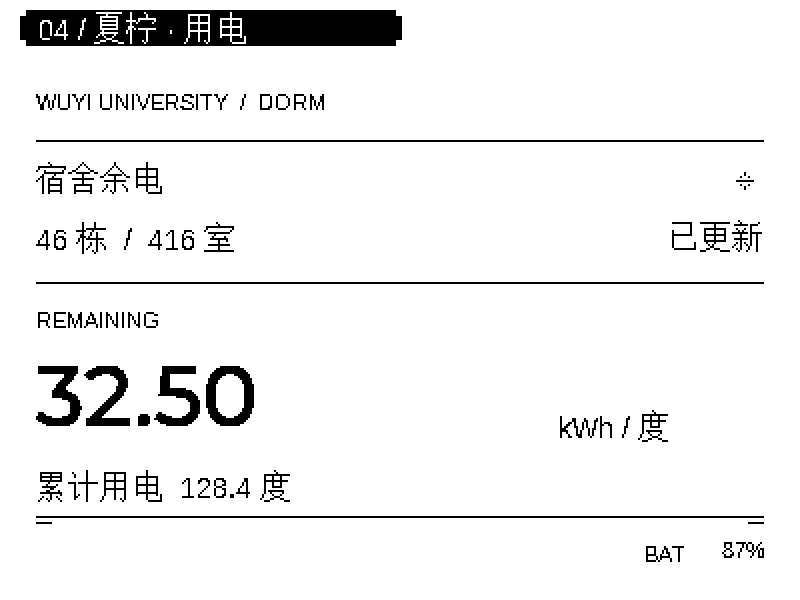

# 夏柠

微雪 ESP32-S3-RLCD-4.2 桌面助手，配套 Windows / macOS Reporter。

当前版本：**1.0.0 候选版**。

## 功能与支持范围

- 开发板显示电脑性能、Agent 状态与额度，以及音乐信息。
- 首页使用可公开分发的原创像素头像；Agent 区域可在任务＋周额度、两项额度、仅任务之间切换。语音唤醒短语为「你好夏柠」。
- 增加「宿舍用电」页，可按五邑大学宿舍楼栋和房间定时查询剩余电量及已用电量；也可让夏柠读出最近一次查询结果。
- 局域网发现电脑、选择绑定电脑，保留配置升级。
- Windows 一体安装器提供仅安装 Reporter、保留配置升级、首次安装三种模式。
- 当前固件改为一次唤醒一轮问答，回答期间不接受语音打断。此项已编译、刷入，实际语音体验待验证。
- 音乐时间沿用当前估算逻辑，不承诺精确实时进度。

硬件目标为 ESP32-S3-RLCD-4.2，16 MB Flash、8 MB PSRAM。不要将固件刷到其他型号。

## 使用

宿舍用电需在设备设置页填写楼栋号和房间号。短按 KEY 可翻到「宿舍用电」页；查询约每 15 分钟更新一次，失败时保留并标明上次数据。学校接口可能只允许校园网访问，因此异地网络下可能无法查询。此功能只查询，不提供充值，也不要求校园账户密码。接口依据 [学校宿舍充电指引](https://www.wyu.edu.cn/zwc/info/1416/3911.htm) 和 [MYHealer 的开源项目](https://github.com/MYHealer/wyu-electricity) 实现；学校接口若调整，查询可能失效。

正式发布后，从项目 Releases 获取对应系统安装包。此源码目录不包含安装包、运行环境或设备配置。

Windows 用户打开安装器后：已有本项目固件选择“保留配置升级”；仅需电脑端选择“仅安装 Reporter”。“首次安装”会清除开发板原有数据，操作前需要确认。刷写过程中保持 USB 连接，保留备份直到验收结束。

Windows 电脑端安装和保留配置刷机已由作者本机验收。macOS 有独立实现与历史验证，但未与本轮 Windows 改动重新做整套验收。

## 源码结构

| 目录 | 内容 |
| --- | --- |
| `xiaozhi/` | 固定小智上游版本的补丁、板级源码和 ESP-IDF 构建入口 |
| `reporter/` | 电脑端状态服务、媒体采集、Windows / Mac 界面 |
| `installer/` | Windows / Mac 安装器源码 |
| `simulator/` | LVGL 界面模拟器、素材及字体生成器 |
| `tests/` | 固件界面与状态逻辑主机测试 |
| `release/` | 发布签名工具、公钥和第三方许可证 |

固件基于 **ESP-IDF 6.0.2**。

构建入口见 [构建说明](docs/BUILD.md)，已知限制见 [发布检查表](docs/RELEASE_CHECKLIST.md)。

版本内容见 [发布说明](docs/RELEASE_NOTES_1.0.0.md)。

## 作者与许可

原项目作者：[黑沐](https://github.com/heimumumu)。本地定制版的界面重构与定制：[玉米](https://github.com/yumi233)。原作者的版权和 MIT 许可声明保持完整；第三方代码、字体和模型保留各自许可证，见 [第三方说明](THIRD_PARTY_NOTICES.md)。

上游项目：<https://github.com/heimumumu/Waveshare_ESP32_RLCD>

公开版不包含本地使用的角色参考图、衍生头像或设备配置。若自行替换头像，请先确认素材有相应的发布授权。
